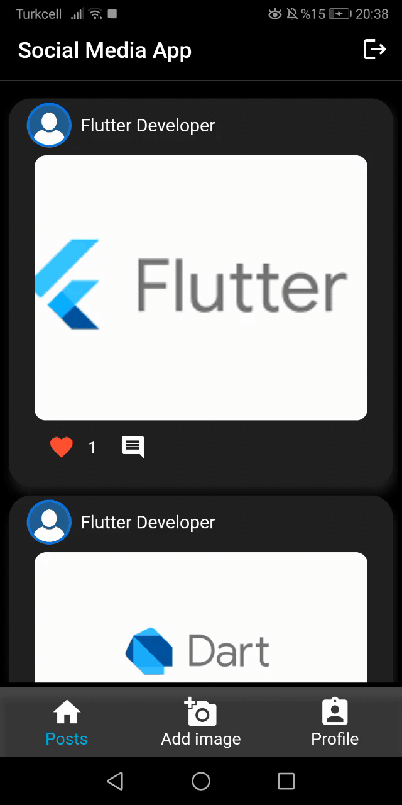
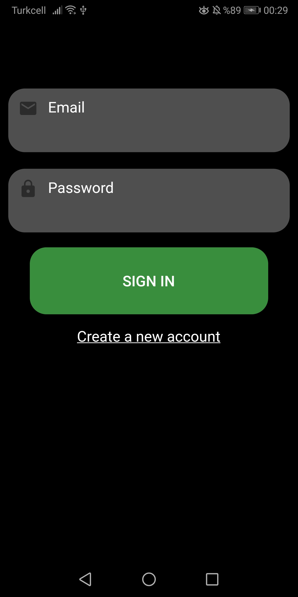
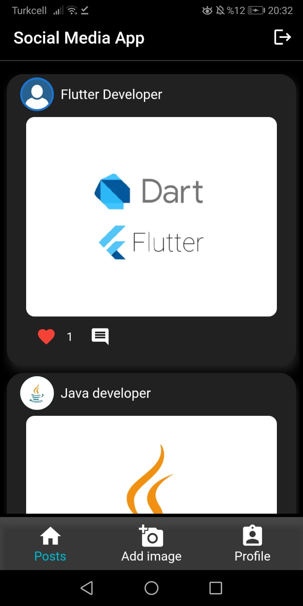
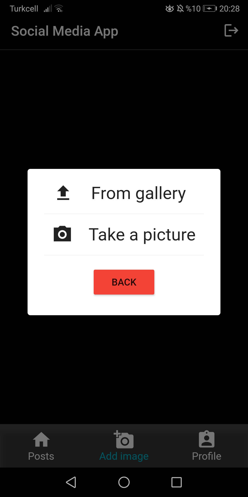

# flutter_socialmedia_app
Social media application built using Flutter and Firebase.Cloud firestore was used for database operations.

## Application gifs
   

## Application screenshoots
  
  
  
